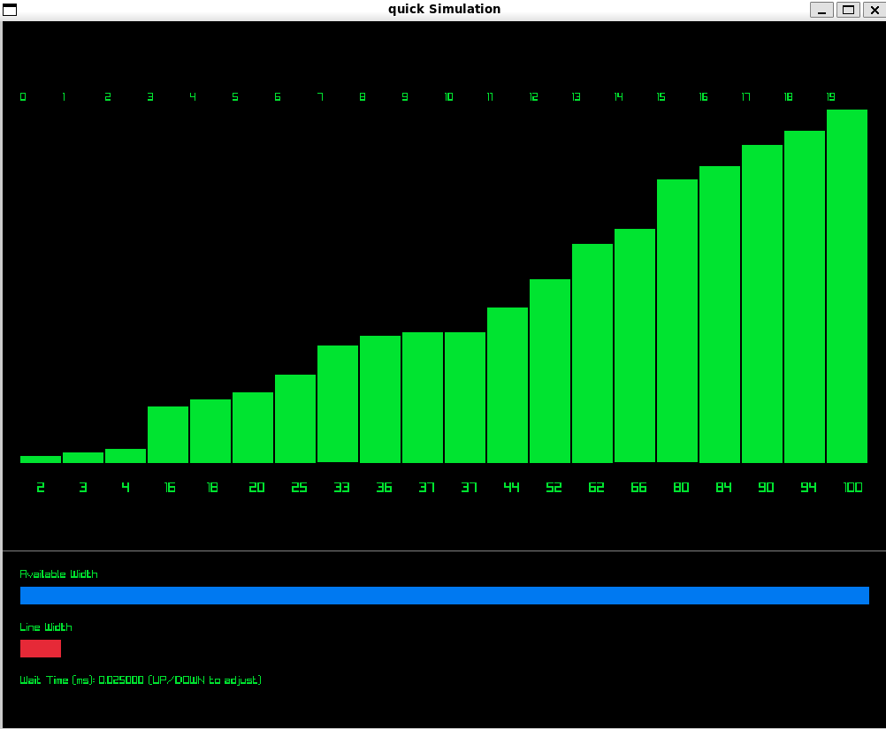
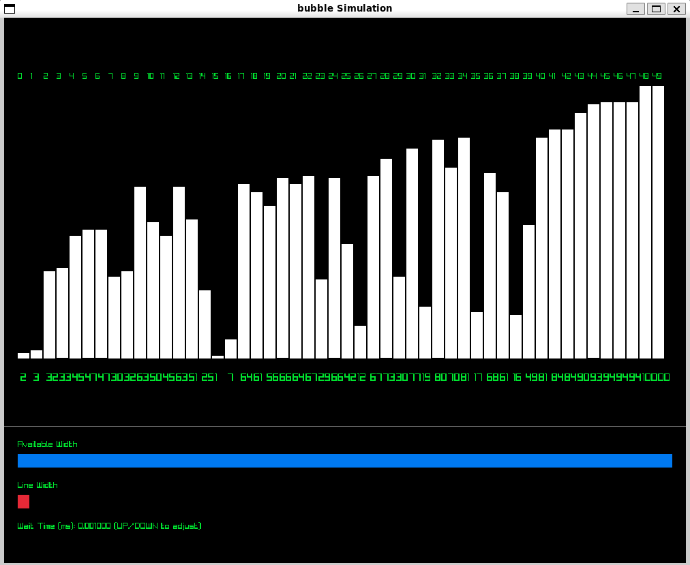
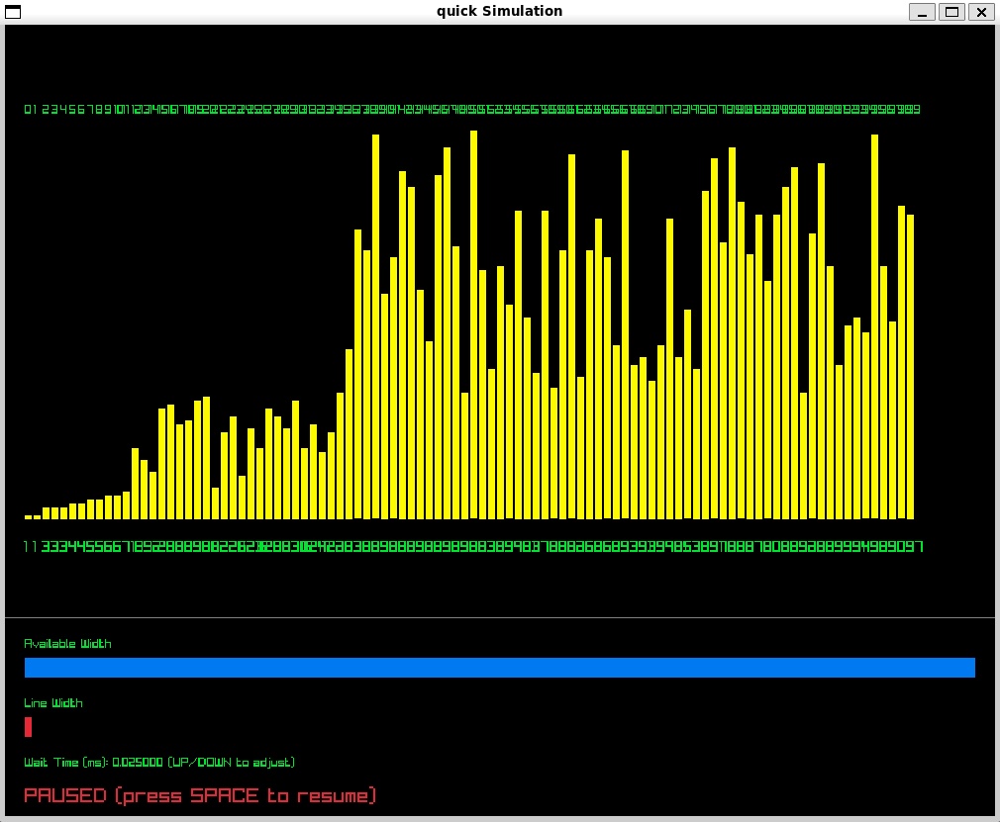

# Sorting Algorithms Visualization

A simple interactive project that demonstrates how different sorting algorithms work by visualizing each step of the sorting process. You can manually change the maximum value of the elements and the amount of the elements before the simulation.

## Screenshots

### Quick Sort Final Result

### Bubble Sort 50 Elements Result

### Quick Sort 100 Elements Pause Functionality

